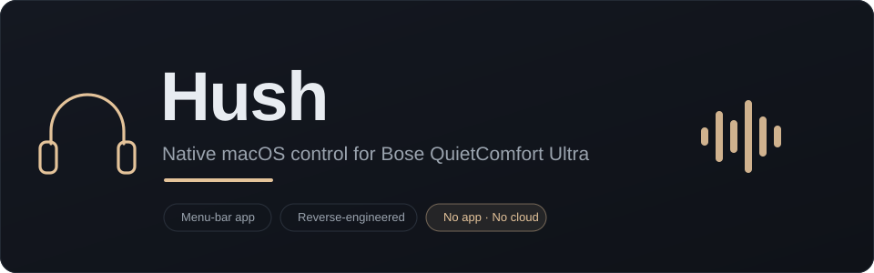
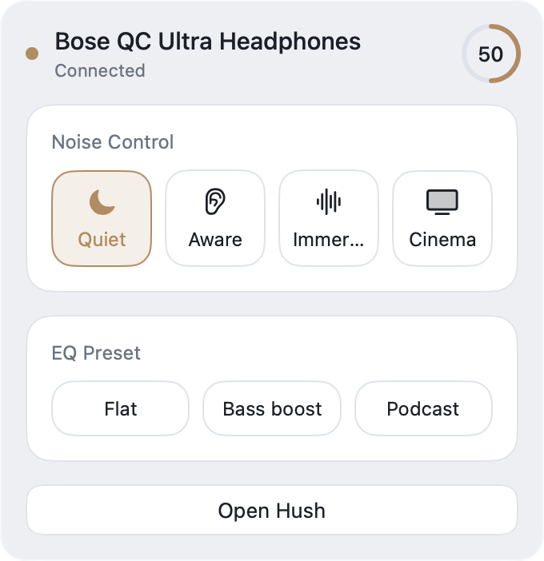
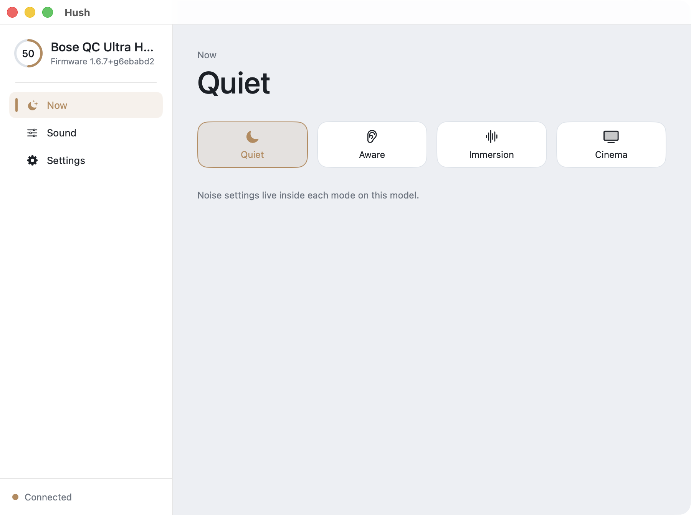
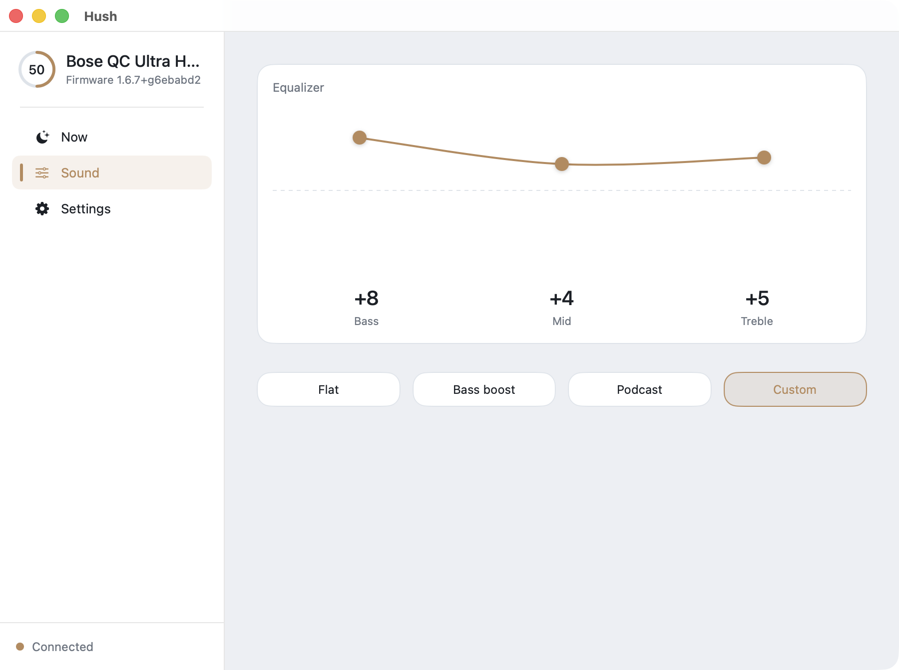
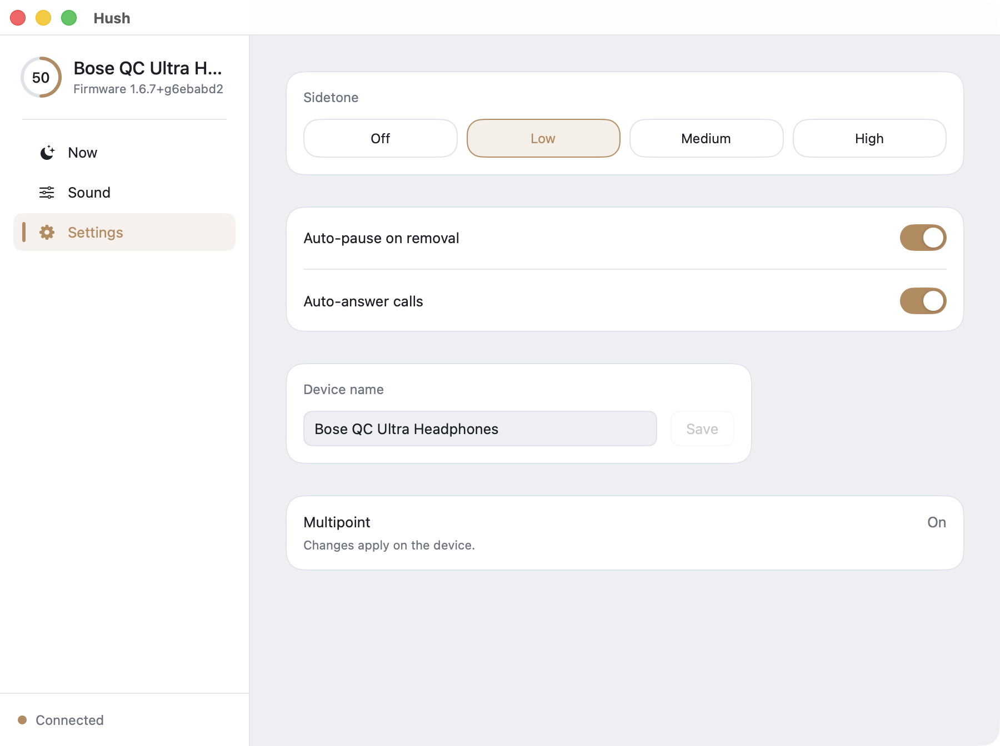
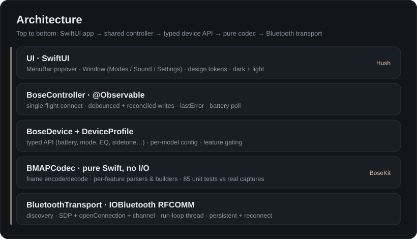

<p align="center">
  
</p>

# Hush

A native **macOS menu-bar app** to control **Bose QuietComfort Ultra** headphones — without the official Bose app.

Bose only ships its companion app for iOS/Android. If you live on a Mac, you have no way to change modes, EQ, or settings from the desktop. Hush talks to the headphones directly over Bluetooth Classic (RFCOMM) using the reverse-engineered **BMAP** protocol — **no app, no cloud, no account**.

> Status: **working v1**, verified on real hardware (Bose QC Ultra Headphones, gen-1, product `0x4066`, firmware `1.6.7`). Built as a personal/developer tool.

---

## Features

- 🎧 **Menu-bar first** — a popover for quick control, plus a full window on demand. Menu-bar–only app (no Dock icon).
- 🎚️ **Listening modes** — switch between Quiet / Aware / Immersion / Cinema (and any custom modes) live.
- 🔊 **3-band equalizer** — an interactive, draggable EQ curve (bass / mid / treble, −10…+10) with presets (Flat, Bass boost, Podcast).
- 🗣️ **Settings** — sidetone level, auto-pause on removal, auto-answer calls, and device name.
- 🔋 **At-a-glance status** — battery, current mode, firmware, connection state.
- 🌗 **Native feel** — light + dark, keyboard focus, calm motion; a calm “quiet instrument” visual language.
- 🔒 **Local only** — everything happens over your Mac's Bluetooth. Nothing leaves the machine.

## Screenshots

Captured from the running app, connected to a real QC Ultra (gen-1). Images follow your GitHub theme — light and dark variants are in `docs/images/`.

<p align="center">
  <picture>
    <source media="(prefers-color-scheme: dark)" srcset="docs/images/popover-dark.png">
    
  </picture>
</p>

<p align="center"><em>Menu-bar popover: battery, mode switch and EQ presets, one click from the menu bar.</em></p>

<p align="center">
  <picture>
    <source media="(prefers-color-scheme: dark)" srcset="docs/images/window-now-dark.png">
    
  </picture>
</p>

<p align="center"><em>Main window, “Now”: the current listening mode and the four mode chips.</em></p>

<table align="center">
  <tr>
    <td align="center" width="50%">
      <picture>
        <source media="(prefers-color-scheme: dark)" srcset="docs/images/window-sound-dark.png">
        
      </picture>
      <br><em>Sound: draggable 3-band EQ + presets</em>
    </td>
    <td align="center" width="50%">
      
      <br><em>Settings: sidetone, auto-pause, auto-answer, name</em>
    </td>
  </tr>
</table>

### Design

The full visual design (menu-bar popover + main window, dark & light) lives as an interactive canvas:
**[View the design →](https://claude.ai/code/artifact/83e0050e-9df4-4385-ace9-7ce217b62775)**

---

## How it works

<p align="center">
  
</p>

Two Swift packages:

- **`BoseKit`** — a dependency-free library: a pure BMAP codec (frame encode/decode + per-feature parsers/builders, covered by 85 unit tests against real captured bytes), an `IOBluetooth` RFCOMM transport (device discovery, the SDP → `openConnection` → channel sequence, a dedicated run-loop thread, a persistent connection with single-flight reconnect), and a typed `BoseDevice` API selected by a per-model `DeviceProfile`.
- **`Hush`** — the SwiftUI app: one shared `@MainActor @Observable BoseController` drives both surfaces; writes are debounced and reconciled from the device.
- **`hushctl`** — a small CLI (`status` / `verify`) used to bring the protocol up on real hardware.

The BMAP protocol work is grounded in the excellent **[bosectl](https://github.com/aaronsb/bosectl)** reverse-engineering project.

---

## Build & run

Requires **macOS 14+** and Xcode's Swift toolchain (Swift 5.9+). No third-party dependencies.

```bash
# Run the tests
cd BoseKit && swift test      # 85 tests
cd ../Hush && swift test      # 16 tests

# Launch the app (headphones paired + connected; grant the terminal Bluetooth permission on first run)
cd Hush && swift run Hush
```

The target MAC defaults to the gen-1 QC Ultra used during bring-up; override with `BOSE_MAC=XX:XX:XX:XX:XX:XX`.

There's also the CLI:

```bash
cd hushctl && BOSE_MAC=<mac> swift run hushctl status
```

---

## Current limitations (gen-1 / product 0x4066)

Hardware bring-up (see `docs/superpowers/notes/`) found that the gen-1 QC Ultra **does not expose the `[31.10]` live audio-settings register** that the QC Ultra 2 uses, and its mode-config layout differs. On this model the official app itself only lets you tune noise settings *inside custom modes*; firmware presets are locked. So in v1:

- **Live ANC / CNC / Wind / Spatial toggles are unavailable** on gen-1 — noise control is done by **selecting a mode**. (These controls are feature-gated and would appear on a device that supports the register, e.g. QC Ultra 2.)
- **Custom-profile editing** is likewise gated off on gen-1 for now.
- **Multipoint** is shown read-only (its write didn't reliably take effect during testing).
- The app reads on connect and polls battery; it doesn't yet re-read after changes made *outside* Hush until relaunch.

## Future improvements

- [ ] **Live noise control on gen-1** via a custom-mode model (write an editable slot + the correct 47-byte ModeConfig layout).
- [ ] A **"Quit Hush"** item in the popover.
- [ ] **Refresh on focus** — re-read state when the popover opens / window gains focus, so external changes reflect immediately.
- [ ] Investigate the **multipoint** write (likely async apply / timing).
- [ ] Verified support for **more Bose models** (QC Ultra 2, QC 45, …) via additional `DeviceProfile`s.
- [ ] Package as a signed/notarized `.app` (LaunchAgent for login start).

---

## Credits & license

- Protocol reverse-engineering reference: **[bosectl](https://github.com/aaronsb/bosectl)** (BMAP).
- An earlier protocol write-up: [docentYT/Bose-QuietComfort-Ultra-Protocol](https://github.com/docentYT/Bose-QuietComfort-Ultra-Protocol) (documentation licensed CC BY-NC-SA).

Not affiliated with or endorsed by Bose. "Bose" and "QuietComfort" are trademarks of Bose Corporation. Use at your own risk.
